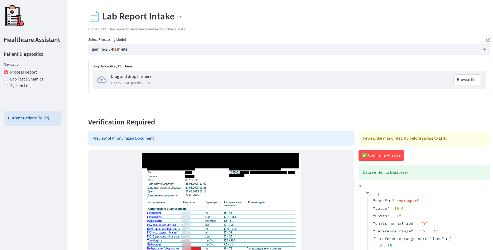
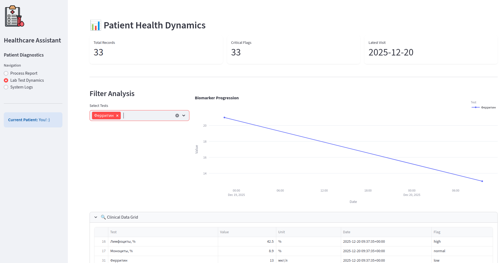

# Healthcare Assistant

*A small project is still under development.*\
AI-based tool for processing personal medical data. Currently, this assistant is only capable of processing laboratory
test results.

---

## The basic pipeline

The basic pipeline currently implemented is as follows:

1. The system runs Named Entity Recognition (NER) to analyze an uploaded document and extract and mask any personal
   information (PII) data.
2. An anonymized document is then passed to a parser, which extracts laboratory test results into a proper text format.
3. The parsed medical data is then processed by an LLM to generate a structured output, which is saved for further
   analysis (e.g., test dynamics monitoring).

---

## Tech stack

- **Frontend:** [Streamlit](https://streamlit.io/)
- **DL/AI Engine**:
    - Tested at the current pipeline: [GLiNER](https://github.com/urchade/GLiNER) (local
      weights), [LlamaParse](https://www.llamaindex.ai/llamaparse) (API), [Google Gemini](https://gemini.google.com/) (
      API)
    - Alternative pipeline steps to test in the
      future: [PaddleOCR](https://github.com/PaddlePaddle/PaddleOCR?ysclid=mjelp06ui4625881594) (both: parse and extract
      structured output), [OpenAI models](https://platform.openai.com/docs/models?ref=robkerr.ai) (process parsed
      documents)
- **Database:** [PostgreSQL](https://www.postgresql.org/) (psycopg
  3) + [SQLAlchemy](https://www.sqlalchemy.org/) + [Alembic](https://alembic.sqlalchemy.org/en/latest/index.html)

---

## Prepare environment

It's better to pre-download [GLiNER model weights](https://huggingface.co/urchade/gliner_multi-v2.1) from Hugging Face
Hub to ensure the container doesn't download them at runtime. After the model has been downloaded to the local HF cache
folder:

- Create a `models_cache` folder in the root of the project.
- Copy local HuggingFace hub files into it: `cp -r ~/.cache/huggingface/* ./models_cache/`

Environment variables should be configured in the `.env` file (in the root directory) – see the `.env.example` file for
details.

To manage Alembic migrations, create an `alembic.ini` file (in the root directory). For more details, please refer to
the [documentation](https://alembic.sqlalchemy.org/en/latest/tutorial.html#tutorial-alembic-ini).

--- 

## Examples

- Upload the document with laboratory test results.

  ❗**Important**: carefully check the anonymized version of the document before accepting processing! Only process if
  all personally identifiable information (PII) data has been masked – results will be shared with the public LLM API.

  *The actual values are hidden manually to prevent them from being publicly displayed.*

- Monitor saved test results and their dynamics.

